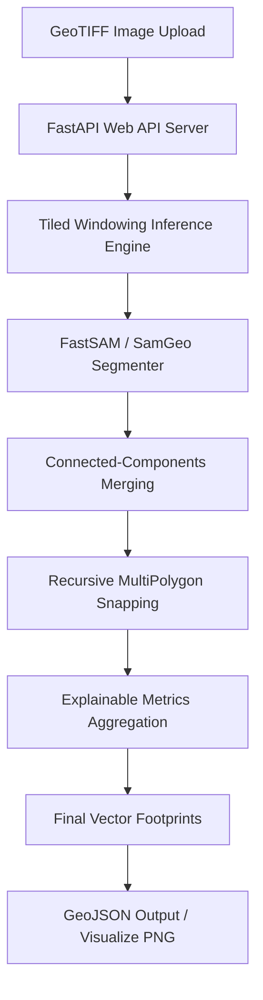

# CadastraVision Project Status Report

This status report outlines the current development progress of **CadastraVision** (focusing on high-precision aerial building footprint extraction).

---

## 🚀 Current Architecture & Core Components



### 1. Web Service Layer (`ai-service/main.py`)
* **Technology**: FastAPI (Python 3.13, Uvicorn server).
* **Endpoints**:
  * `GET /health`: Returns API status, PII-compliance declaration, and default model configuration.
  * `POST /api/v1/segment`: Processes uploaded GeoTIFF files and returns a standard GeoJSON `FeatureCollection` with confidence scores and shape breakdowns.
  * `POST /api/v1/segment/visualize`: Generates a high-contrast visual PNG image with building borders traced.

### 2. Cadastral Segmentation Engine (`ai-service/ai/segmentation.py`)
* **Technology**: `samgeo`, `fastsam`, `rasterio`, `shapely`, and `pyproj`.
* **Features**:
  * **Windowed Tile Inference**: Divides large imagery into `512x512` chunks to manage memory and prevent out-of-memory errors on GTX 1650 GPUs.
  * **Zero-PII Compliance**: Operates locally on rasters and vector bounds, storing zero coordinates or identifiable labels.

---

## 🛠️ Work Accomplished & Optimizations Made

### 1. High-Contrast Styling (Traced Visuals)
* Removed muddy semi-transparent mask overlays from the visualization rendering.
* Configured the output to draw **pure BGR yellow outlines `(0, 255, 255)`** at a thickness of **`3px`**, matching production cadastral style guides.

### 2. SAM Automatic Mask Generator Configuration
* **`pred_iou_thresh = 0.70`**: Prevents the rejection of large, homogeneous building rooftops with little interior texturing.
* **`stability_score_thresh = 0.80`**: Lowers threshold levels to tolerate shadows and lighting gradients across angled roofs.
* **`min_mask_region_area = 1000`**: Discards small ground details during the initial prediction pass.
* **`crop_n_layers = 1`** & **`box_nms_thresh = 0.70`**: Mitigates duplicate and nested sub-segments.

### 3. Tiled Filtering & Size Restraints
* **`max_area_ratio = 0.70`**: Filters out large background grids (which cover > 80% of a tile chunk) while preserving buildings (which fill 20% to 50%).
* **`min_area = 1000.0` pixels**: Filters out parking lines, cars, and shadows, while retaining smaller structures and houses.

### 4. Continuous Rooftop Merge & Boundary Snapping
* **Connected-Components Merger**: Buffers overlapping geometries outwards by `1.2` meters in metric CRS space to join disjoint rooftop segments and tile boundaries before shrinking them back.
* **Recursive MultiPolygon Orthogonalizer**: Patched the snapping algorithm to iterate through disjoint sub-polygons recursively, preventing coordinate geometry exterior errors.
* **Metadata Schema Conformance**: Combines regularity and compactness metrics via average computation to return structured confidence breakdowns.

---

## 📈 Verification & Testing Status

* **Synthetic Pipeline Self-Test**: The assertion block in `ai-service/ai/segmentation.py` compiles and runs successfully, returning zero errors:
  ```bash
  python ai-service/ai/segmentation.py
  # Output: All pipeline assertions passed successfully!
  ```
* **Interactive Endpoint Test**: Successfully processed live drone imagery through the FastAPI gateway, producing:
  * **`output.geojson`**: Structured vectors with confidence values.
  * **`output_visualized.png`**: Visual rendering showing fully-merged long building footprints.

---

## 🔮 Upcoming Milestones
1. **Mock Database Layer**: Store parcel vectors in a downstream relational schema for temporal query logging.
2. **Dashboard UI**: Construct an interactive UI using React/Vite with deck.gl/Leaflet to visualize the GeoJSON parcel polygons in real time.
